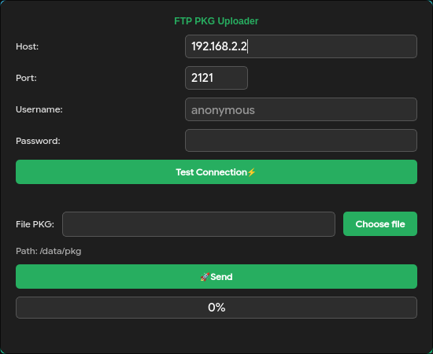

# PS4-PKG-SENDER
Transfer PS4 PKG game files from PC to PlayStation 4 via FTP with real-time progress and dark green UI.
# PS4-PKG-SENDER 🎮

**Created by Agravix**

Send PS4 PKG game files from PC to PlayStation 4 over FTP.

ارسال فایل‌های بازی PS4 از کامپیوتر به پلی‌استیشن ۴ از طریق FTP.
## 📸 Screenshot | اسکرین‌شات


---

## 📥 Download

- `PS4-PKG-SENDER.exe` (Windows)
- `ftp_uploader.py` (Source Code)
- `requirements.txt`

---

## ✨ Features | امکانات

- 🟢 Dark green modern UI / ظاهر تیره سبز و مدرن
- ⚡ FTP connection test on port 2121 / تست اتصال FTP روی پورت ۲۱۲۱
- 📂 Auto create `data/pkg` folder on PS4 / ساخت خودکار پوشه data/pkg روی PS4
- 📊 Real upload percentage with green progress bar / درصد واقعی آپلود با نوار سبز
- 🕒 No timeout for large files / بدون تایم‌اوت برای فایل‌های حجیم
- 🧵 Smooth GUI during upload / رابط کاربری روان هنگام آپلود

---

## ⚠️ Important Notice | توجه مهم

**Make sure the `pkg` folder already exists inside `/data` on your PS4 before uploading.**

The application will attempt to create the folder automatically, but for best results, verify that `/data/pkg` exists on your PS4 beforehand.

**حتماً قبل از آپلود، پوشه‌ی `pkg` در مسیر `/data` روی PS4 شما از قبل وجود داشته باشد.**

برنامه به‌طور خودکار سعی می‌کند پوشه را بسازد، اما برای اطمینان بیشتر، وجود پوشه‌ی `/data/pkg` را روی PS4 از قبل بررسی کنید.

---

## 🚀 Usage | روش استفاده

1. Run `PS4-PKG-SENDER.exe` or `python ftp_uploader.py` / برنامه را اجرا کنید
2. Host: `192.168.2.2` (default) enter ps4 ip / آی‌پی پیش‌فرض ایپی پی اس فور را وارد کنید
3. Port: `2121` / پورت
4. Click `⚡ Test Connection` / دکمه تست اتصال را بزنید
5. Select `.pkg` file / فایل PKG را انتخاب کنید
6. Click `🚀 send` / دکمه ارسال را بزنید
7. File goes to `/data/pkg` on PS4 / فایل در مسیر data/pkg روی PS4 قرار می‌گیرد

---

## 📋 Requirements | نیازمندی‌ها

- PS4 with FTP payload (GoldHEN etc) / PS4 با پایلود FTP فعال
- PC and PS4 on same network / کامپیوتر و PS4 در یک شبکه
- **`/data/pkg` folder exists on PS4** / **پوشه data/pkg روی PS4 وجود داشته باشد**
- For source code: Python 3.7+ and PyQt6 / برای اجرای سورس کد: پایتون و PyQt6

---

📂 PS4 Remote Path | مسیر مقصد روی PS4

/data/pkg

---

## 📦 Run from Source | اجرا از سورس

```bash
pip install -r requirements.txt
python ftp_uploader.py

```
---

🛠️ License | مجوز

MIT © Agravik

---

Made for the PS4 community ❤️
